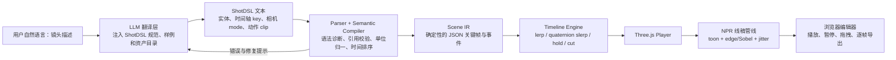

# Shot DSL

文本化 3D 动态分镜预演工具：把自然语言镜头描述转换为可校验、可版本化的 ShotDSL，再在浏览器中生成可播放、可拖拽时间轴的 3D 动态分镜。

## 当前状态

`main` 已具备可运行的第一版 Web MVP，覆盖推荐实施顺序的第 1～5 项：

- ShotDSL v0.1 行式 Parser、语义校验、带行号诊断和 Scene IR；
- Three.js 低模场景、程序化关节人物和四种相机模式；
- 绝对时间轴求值、linear/smoothstep/hold、quaternion slerp 和 camera cut；
- 基于几何轮廓与双描边的 NPR 线稿风格；
- 播放、暂停、回到开头、时间轴拖拽和 PNG 当前帧导出；
- 双人巷战、三人混战、跟拍追逐和环绕建立镜头四个快捷示例。

已完成的静态线稿原型归档在远端分支：

```text
prototype/storyboarder-sts
```

该原型仅作为交互和视觉参考，正式实现不会继承其 parser、Three.js r84 运行时或人物资产。

## 本地运行

需要 Node.js 22 或更高版本：

```bash
npm install
npm run dev
```

浏览器打开 `http://127.0.0.1:4173`。生产构建及静态服务：

```bash
npm run build
npm start
```

完整检查包括语言编译与时间轴单元测试；浏览器烟测会验证 WebGL 渲染、播放、示例切换、任意 seek、camera cut、错误诊断和 PNG 画布：

```bash
npm run check
npm run smoke
```

## 产品目标

用户只需描述场景、人物动作和镜头意图，系统即可生成一个能播放、暂停、拖拽和逐帧导出的 3D 动态分镜预演。

核心价值：

- 用文本快速表达镜头调度，而不是手工摆放所有关键帧；
- 用 DSL 和内部关键帧模型保证结果可复现、可编辑、可测试；
- 用低成本 3D 与粗线稿风格验证构图、走位、节奏和剪辑；
- LLM 只负责翻译意图，不直接控制播放器运行时。

## 推荐架构



## 核心设计原则

1. **DSL 是产品契约**：LLM、手写编辑器和未来可视化编辑器都输出同一 ShotDSL。
2. **Scene IR 是运行时契约**：Parser 之后只处理确定性 JSON，不在渲染层解释自然语言。
3. **随机必须可复现**：所有自动构图、抖线和轻微手持效果都由显式 seed 驱动。
4. **时间轴可任意 seek**：拖到任意时间点都应直接求值得到相同状态，不能依赖从 0 秒逐帧播放。
5. **硬切是离散事件**：位置和缩放用 lerp，旋转用 quaternion slerp；`cut`、可见性和字符串属性不插值。
6. **LLM 可替换**：模型供应商不得成为 DSL、Parser 或播放器的依赖。

## 方案结论

- 自然语言 → ShotDSL：可行，但必须有语法约束、解析校验和自动修复回路。
- ShotDSL → JSON 关键帧：高可行，应优先于 LLM 和视觉风格实现。
- Three.js 动态播放器：高可行，角色动作使用 `AnimationMixer`，场景变换使用自研确定性时间轴求值器。
- RoughJS-WebGL：按原描述不可直接采用。官方 Rough.js 是 Canvas/SVG 库，不提供 WebGL 3D 渲染器。
- 粗线条风格：可用 Three.js NPR 后处理实现；Rough.js 可作为静帧标注或二维覆盖层实验。

## 文档

- [技术可行性与实施路线](docs/feasibility.md)
- [ShotDSL v0.1 草案](docs/shotdsl-v0.1.md)

## 建议实施顺序

```text
ShotDSL 规范与 Parser
  → Scene IR 与确定性 Timeline Engine
  → Three.js 播放器与时间轴 UI
  → NPR 粗线稿风格
  → 当前帧导出
  → LLM 翻译/修复回路
  → glTF 动作资产与视频导出
```

当前里程碑已经验证手写 DSL 到动态播放器的完整链路。下一阶段再接入 LLM 翻译/修复回路，并用标准 glTF 人物和动作 clip 替换程序化占位人物。
