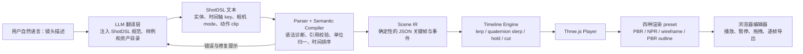

# Shot DSL

文本化 3D 动态分镜预演工具：把自然语言镜头描述转换为可校验、可版本化的 ShotDSL，再在浏览器中生成可播放、可拖拽时间轴的 3D 动态分镜。

## 当前状态

`main` 已具备可运行的 Web MVP，当前演示目标收敛为“游戏级拟真人物 + 动捕动作 + 电影镜头”：

- ShotDSL v0.1 行式 Parser、语义校验、带行号诊断和 Scene IR；
- Three.js cinematic / rough-ink / wireframe / cinematic-outline 四种渲染 preset、glTF 骨骼人物和五种相机模式；
- 绝对时间轴求值、linear/smoothstep/hold、quaternion slerp 和 camera cut；
- AnimationMixer 绝对时间采样、动作 crossfade 和多人物独立骨架；
- ACES tone mapping、室内环境反射、三点布光、软阴影和保留贴图的电影模式；
- 适配蒙皮人物的 OutlineEffect 与静态几何双描边线稿模式；
- 播放、暂停、回到开头、时间轴拖拽和 PNG 当前帧导出；
- 确定性手持抖动、镜头 roll、骨骼跟拍和击打接触特写；
- Catalog 驱动的 style/action/model 别名规范化、模型级动作能力诊断和无静默 Idle 降级；
- `talk` / `reach` / `look-around` 表演动作和按 point/entity/bone 定位的确定性 `gaze` 约束；
- 游戏角色追踪、拳击覆盖、群体调度、长时间轴及五个兼容表达示例共 12 个内置场景。

已完成的静态线稿原型归档在远端分支：

```text
prototype/storyboarder-sts
```

该原型仅作为交互和视觉参考，正式实现不会继承其 parser、Three.js r84 运行时或人物资产。

### 当前产品演示目标

现阶段以“Sketchfab 游戏级拟真人物 + 动捕动作 + 电影镜头”作为产品演示目标，验收标准是：

- 默认画面必须使用带纹理、蒙皮和真人比例的游戏角色，不再以方块人或无材质假人代表视觉上限；
- 原生 Walk / Run 动捕可交叉淡化，并可在手持跟拍、建立镜头和长焦镜头间硬切；
- 走、跑、直拳、后手直拳、摆拳、头部受击、倒地动作在镜头中可直接辨识；
- 双人和三人场景的骨架、动作时间及混合状态彼此独立；
- 任意拖拽时间轴可重复得到相同姿势，资产加载失败必须显示 fallback 状态；
- 近景使用较长焦段，避免广角透视再次放大头部和上身；
- 击打特写必须解析真实拳头/头部骨骼，命中峰值的两骨骼距离进入浏览器回归检查。
- 长节目必须支持分钟级时间显示和跨 5 分钟随机 seek，结果不能依赖从第 0 秒逐帧播放。

默认评审示例使用 `game-ready-soldier`：带贴图的约 2.1 MB 蒙皮角色，提供原生 `Idle / Walk / Run` 动作和 Mixamo 骨骼语义映射。该资产来自 three.js 官方动画示例，仅用于内部原型，外部或商业发布前必须重新核验上游资产授权。

`human-mannequin` 来自 Mesh2Motion/Quaternius 的 CC0 humanoid，内置 16 个动作 Clip，继续承担拳击、受击、倒地和体操示例。它的价值是动作与骨架原生匹配，不代表最终人物材质上限。运行时会把两类模型统一到 1.78 米并为每个 actor 克隆独立骨架。

当前没有把拳击动作直接运行时重定向到游戏角色：实测两个资产的 bind pose 不一致会造成肩臂畸变。正确的下一步是引入与目标人物同骨架、离线校正过的成套动捕资产，或建立带 rest-pose 校准的离线 retarget pipeline，而不是在浏览器中静默接受错误姿势。

ShotDSL 语义动作 `punch`、`cross`、`hook` 分别映射到不同拳法。旧的 `kick` 名称暂时为兼容 v0.1 保留，但当前人形动作库尚无真实踢击 Clip，因此它不进入产品演示样例。

长节目示例使用 5 人队形和准备、伸展、踏步、开合跳、侧步、下蹲、俯卧撑、节奏整理、放松 9 个分节。它用于验证长时间轴和动作编排能力，并非对任何特定官方广播体操套路的逐节复刻。

## 本地运行

需要 Node.js 22 或更高版本：

```bash
npm install
npm run dev
```

浏览器打开 `http://127.0.0.1:4173`。生产构建及静态服务：

```bash
npm run build
npm start
```

### 管理场景示例

场景示例保存在 [`examples/`](examples/) 目录，每个 `.shotdsl` 文件对应下拉框中的一个示例，文件名（不含扩展名）就是显示名称。新增、改名或编辑文件后：

- `npm run dev` 会自动同步目录，刷新页面即可看到变化；
- `npm run build` 会重新扫描目录，并把示例文件和自动生成的清单写入 `dist/examples/`；
- 默认示例是 `游戏角色 · 追踪镜头.shotdsl`，删除它后会使用按中文文件名排序的第一个示例。

完整检查包括语言编译与时间轴单元测试；浏览器烟测会验证 glTF 加载、蒙皮人物数量、无 fallback、播放、任意 seek、camera cut、错误诊断和 PNG 画布：

```bash
npm run check
npm run smoke
```

## 产品目标

用户只需描述场景、人物动作和镜头意图，系统即可生成一个能播放、暂停、拖拽和逐帧导出的 3D 动态分镜预演。

核心价值：

- 用文本快速表达镜头调度，而不是手工摆放所有关键帧；
- 用 DSL 和内部关键帧模型保证结果可复现、可编辑、可测试；
- 用浏览器实时 PBR 或粗线稿风格验证人物动作、构图、走位、节奏和剪辑；
- LLM 只负责翻译意图，不直接控制播放器运行时。

## 推荐架构



## 核心设计原则

1. **DSL 是产品契约**：LLM、手写编辑器和未来可视化编辑器都输出同一 ShotDSL。
2. **Scene IR 是运行时契约**：Parser 之后只处理确定性 JSON，不在渲染层解释自然语言。
3. **随机必须可复现**：所有自动构图、抖线和轻微手持效果都由显式 seed 驱动。
4. **时间轴可任意 seek**：拖到任意时间点都应直接求值得到相同状态，不能依赖从 0 秒逐帧播放。
5. **硬切是离散事件**：位置和缩放用 lerp，旋转用 quaternion slerp；`cut`、可见性和字符串属性不插值。
6. **LLM 可替换**：模型供应商不得成为 DSL、Parser 或播放器的依赖。

## 方案结论

- 自然语言 → ShotDSL：可行，但必须有语法约束、解析校验和自动修复回路。
- ShotDSL → JSON 关键帧：高可行，应优先于 LLM 和视觉风格实现。
- Three.js 动态播放器：高可行，角色动作使用 `AnimationMixer`，场景变换使用自研确定性时间轴求值器。
- RoughJS-WebGL：按原描述不可直接采用。官方 Rough.js 是 Canvas/SVG 库，不提供 WebGL 3D 渲染器。
- 粗线条风格：可用 Three.js NPR 后处理实现；Rough.js 可作为静帧标注或二维覆盖层实验。

## 文档

- [文档导航](docs/README.md)
- [技术可行性与实施路线](docs/feasibility.md)
- [ShotDSL v0.1 草案](docs/shotdsl-v0.1.md)
- [ShotDSL 支持能力评估](docs/support-matrix.md)

## 建议实施顺序

```text
ShotDSL 规范与 Parser
  → Scene IR 与确定性 Timeline Engine
  → Three.js 播放器与时间轴 UI
  → NPR 粗线稿风格
  → 当前帧导出
  → LLM 翻译/修复回路
  → 标准 humanoid 动作资产与 IK
  → 视频导出
```

当前里程碑已经验证手写 DSL、游戏角色原生移动动捕、电影镜头和多人战斗动作的完整链路。下一阶段优先引入与目标人物骨架匹配的拳击/受击动捕包和 rest-pose 校准流程，再补接触 IK、面部 Blendshape 与 LLM 翻译/修复回路。
